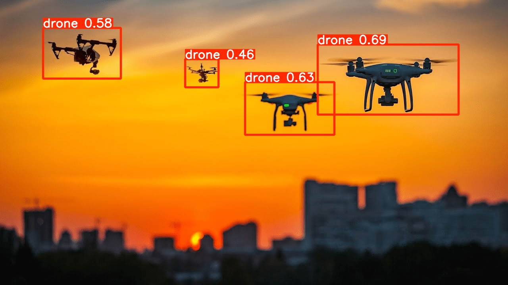

# 🚁 YOLOv8 Drone Detection

A real-time drone detection app powered by **YOLOv8** and **Streamlit**. Upload an image or use your webcam to detect drones using a custom-trained YOLOv8 model.

---



---

## 📌 Features

- Custom-trained YOLOv8 model (`best.pt`) for drone detection
- Interactive web interface built with Streamlit
- Supports image upload and inference
- Bounding box visualization with confidence scores
- Jupyter notebook included for training/experimentation

---

## 🗂️ Project Structure
```
yolov8_drone_detection/
├── best.pt                  # Trained YOLOv8 model weights
├── streamlit_app.py         # Streamlit web application
├── drone_detection.ipynb    # Jupyter notebook for training/testing
├── drone.jpg                # Sample drone image
├── requirements.txt         # Python dependencies
└── packages.txt             # System-level packages
```

---

## ⚙️ Installation

### 1. Clone the repository
```bash
git clone https://github.com/Kellysmoky123/yolov8_drone_detection.git
cd yolov8_drone_detection
```

### 2. (Optional) Create a virtual environment
```bash
python -m venv venv
source venv/bin/activate        # Linux/Mac
venv\Scripts\activate           # Windows
```

### 3. Install dependencies
```bash
pip install -r requirements.txt
```

> If you're on a system that requires additional packages (e.g., `libGL`), install them via:
> ```bash
> cat packages.txt | xargs sudo apt-get install -y
> ```

---

## 🚀 Usage

### Run the Streamlit App
```bash
streamlit run streamlit_app.py
```

Then open your browser at `http://localhost:8501`.

Upload an image (e.g., `drone.jpg`) and the app will display detection results with bounding boxes and confidence scores.

---

### Run the Jupyter Notebook
```bash
jupyter notebook drone_detection.ipynb
```

Use this notebook to explore the model, run inference, or retrain on custom data.

---

## 🧠 Model

The model (`best.pt`) is a custom-trained YOLOv8 model fine-tuned for drone detection. It was trained using the [Ultralytics YOLOv8](https://github.com/ultralytics/ultralytics) framework.

To use the model directly in Python:
```python
from ultralytics import YOLO

model = YOLO("best.pt")
results = model("drone.jpg")
results[0].show()  # Display results
```

---

## 📦 Requirements

- Python 3.8+
- [ultralytics](https://github.com/ultralytics/ultralytics)
- streamlit
- opencv-python
- Pillow

> See `requirements.txt` for the full list.

---

## 📄 License

This project is open-source. Feel free to use and modify it.

---

## 🙌 Acknowledgements

- [Ultralytics YOLOv8](https://github.com/ultralytics/ultralytics)
- [Streamlit](https://streamlit.io/)
